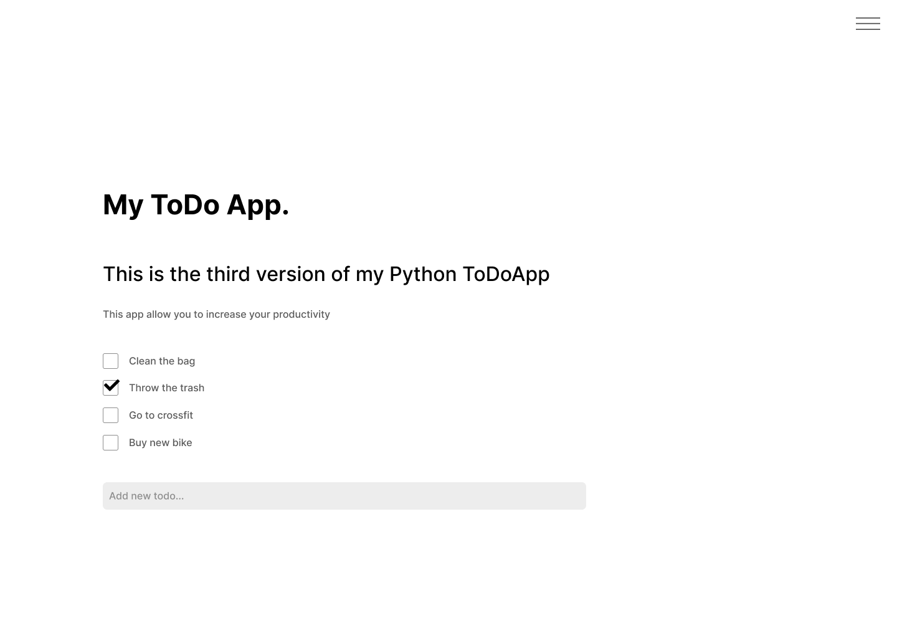

# ToDoApp

Création d'une ToDo list en python de trois manières différntes.
## Objectifs

1. Créer une première version en ligne de commande
2. Créer une deuxième version en GUI (PySimpleGui)
3. Créer une troisième version en webapp avec Streamlit

### Version présentée

Ici il sagit de la version trois, disponible en ligne sur Streamlit: [MyToDoApp](https://fred-fittywebdev-todo-app-v3-web-6agl6z.streamlit.app/)

### Design

